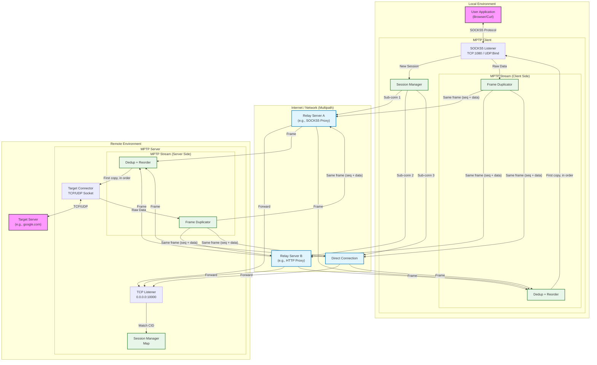

# MPTP Architecture

## System Overview

MPTP (Multipath Transport Protocol) carries one logical tunnel over several reliable connections for resilience. Every frame is sent on every path that has room (at most 64 KiB queued on it); the receiver keeps the first copy of each frame, drops the duplicates and puts the frames back in order. MPTP therefore keeps a tunnel going when one path fails, but it does not add bandwidth, and its traffic is multiplied by the number of paths. It has no authentication or encryption of its own. Configuration is on the [MPTP page](https://peakpassvpn.github.io/sail/mptp/).



## Protocol Sequence

This diagram details the connection establishment and data transfer phases.

```mermaid
sequenceDiagram
    participant App as User App
    participant Client as MPTP Client
    participant Relay1 as Relay Server A
    participant Relay2 as Relay Server B
    participant Server as MPTP Server
    participant Target as Target Server

    Note over App, Client: SOCKS5 Handshake
    App->>Client: SOCKS5 Init (No Auth)
    Client-->>App: SOCKS5 Choice (No Auth)
    App->>Client: SOCKS5 Request (Connect/UDP, DST)
    
    Note over Client, Server: MPTP Session Establishment
    Client->>Client: Generate CID (UUID)
    
    par Establish multiple sub-connections (Multipath via Relays)
        Note over Client, Relay1: Path 1 (via Relay A)
        Client->>Relay1: Connect
        Relay1->>Server: Connect (Proxy)
        Client->>Server: Handshake [VER, CID, CMD, DST_ADDR, DST_PORT]
    and
        Note over Client, Relay2: Path 2 (via Relay B)
        Client->>Relay2: Connect
        Relay2->>Server: Connect (Proxy)
        Client->>Server: Handshake [VER, CID, CMD, DST_ADDR, DST_PORT]
    and
        Note over Client, Server: Path 3 (Direct)
        Client->>Server: Connect
        Client->>Server: Handshake [VER, CID, CMD, DST_ADDR, DST_PORT]
    end

    Server->>Server: CID lookup, join existing session or create new
    alt TCP mode
        Server->>Target: TCP connect to destination
    else UDP mode
        Server->>Server: Prepare UDP forwarding socket
    end
    Client-->>App: SOCKS5 success reply

    loop Data tunneling, every frame on every path
        App->>Client: TCP bytes or UDP packet
        Client->>Client: Frame with a sequence number
        Client->>Server: Send the same frame on every sub-connection with room
        Server->>Target: Forward to destination
        Target->>Server: Return traffic
        Server->>Client: Return the same way; the first copy wins
        Client-->>App: Deliver to app
    end

```
