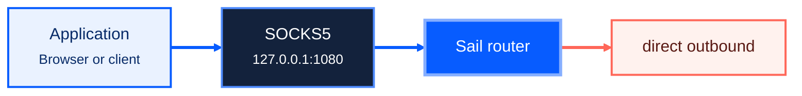

Sail is a reusable proxy core for clients, servers and relays. This guide builds the CLI, starts a local SOCKS5 listener and sends traffic through a direct outbound. It is intentionally small, but it uses the same configuration model as a production deployment.

## What you will run



You need Rust, Cargo, CMake, a C/C++ compiler and libclang. BoringSSL is compiled from source as part of the build. There is no prebuilt release yet. See [Installation](/sail/installation/) for platform notes.

## 1. Build the CLI

From the repository root:

```sh
cargo build -p sail-cli --release
./target/release/sail -V
```

The resulting executable is `target/release/sail`.

## 2. Create a configuration

Save this as `config.json`:

```json
{
  "log": {
    "level": "info",
    "format": "compact"
  },
  "inbounds": [
    {
      "type": "socks",
      "tag": "local-socks",
      "listen": "127.0.0.1",
      "listen_port": 1080
    }
  ],
  "outbounds": [
    {
      "type": "direct",
      "tag": "direct"
    }
  ],
  "route": {
    "final": "direct"
  }
}
```

The inbound accepts SOCKS5 TCP and UDP traffic. The router sends every connection that does not match a rule to `direct`.

This is sing-box JSON, Sail's native format. Sail also reads a Clash/Mihomo YAML file (`.yaml`, `.yml`) or a Surge profile (`.conf`) directly; the extension selects the format. `config.json` is also the default path, so `-c config.json` may be left out.

## 3. Validate before starting

```sh
./target/release/sail -c config.json -T
```

Sail prints `ok` and exits when the file parses and every inbound, outbound, DNS server and rule builds. Unknown fields, missing outbound tags and invalid rule combinations fail here instead of during startup.

## 4. Run and verify

Start Sail:

```sh
./target/release/sail -c config.json
```

In another terminal, send a request through the local proxy:

```sh
curl --socks5-hostname 127.0.0.1:1080 https://example.com
```

Using `--socks5-hostname` lets Sail receive the domain name rather than a locally resolved address, which gives domain routing rules the information they need.

:::tip
During configuration work, run with `--auto-reload`. Sail watches the file and reloads it after changes.
:::

## Where to go next

- [Configuration](/sail/configuration/) explains the top-level model and defaults.
- [Routing](/sail/routing/) shows domain, IP, port, inbound and process rules.
- [Protocols](/sail/protocols/) maps inbound, outbound and transport support.
- [MPTP](/sail/mptp/) builds a client/server multipath tunnel.
- [CLI reference](/sail/cli/) covers validation, connectivity tests and runtime profiles.
